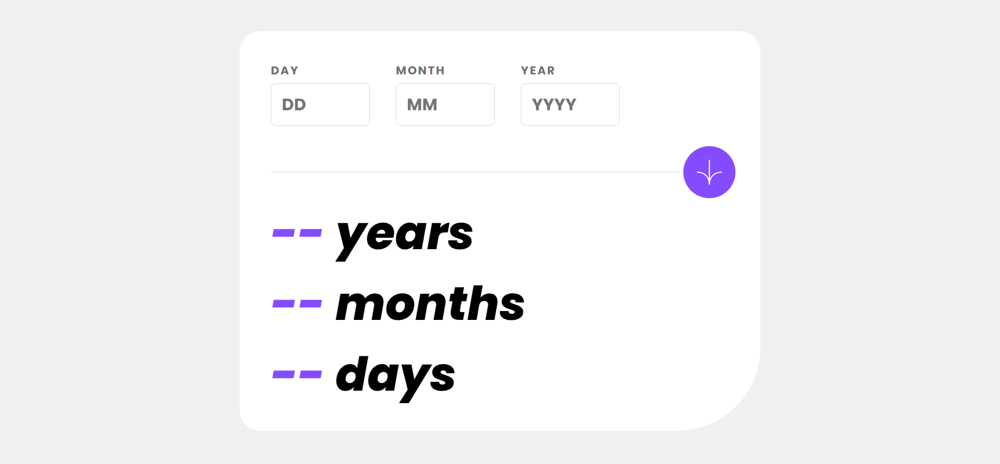
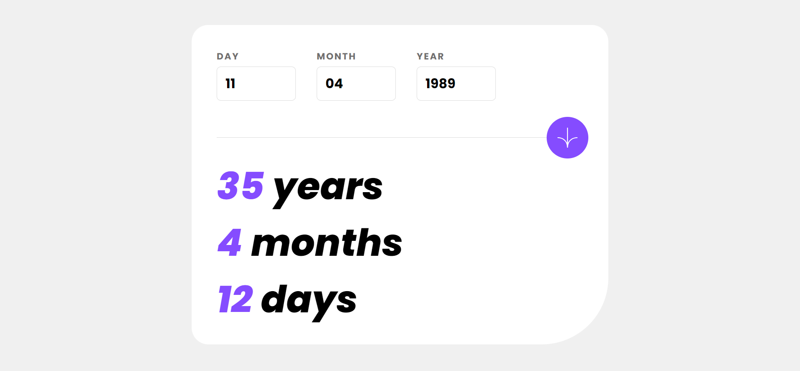

# Age Calculator App

## Description

This is an age calculator app developed as part of a challenge from [Frontend Mentor](https://www.frontendmentor.io). The app allows users to input their birthdates and then calculates their exact age in years, months, and days.

## Screenshots

## Links
- Solution URL: [Github](https://github.com/ft-manchon/age-calculator-frontend-mentor)
- Live Site URL: [Age Calculator app](https://ft-manchon.github.io/age-calculator-frontend-mentor/)

## Technologies
- HTML5
- CSS3
- JavaScript

## Development Process

### Built with

- Semantic HTML5
- Mobile-first workflow
- JS to validate the inputs e calculate the exact age
